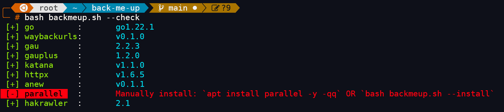
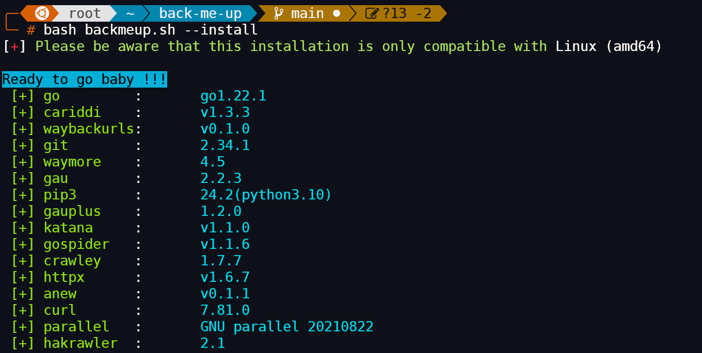
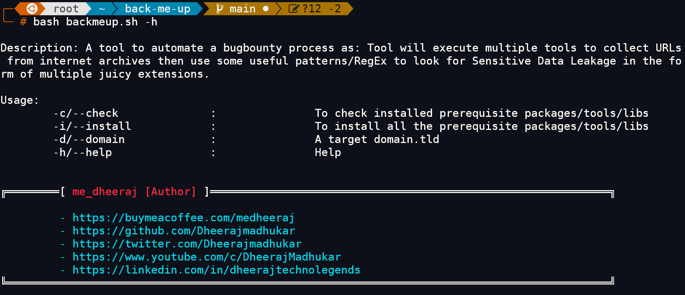

<div align="center">
  <!--  -->
<h1>BACK-ME-UP</h1>
  
  <p>
    A tool to automate a bugbounty process as: Tool will execute multiple tools to collect URLs from internet archives then use some useful patterns/RegEx to look for Sensitive Data Leakage in the form of multiple juicy extensions.
  </p>
  
  
<!-- Badges -->
<h4>
    <a href="https://youtu.be/HenECEU9c34">View Demo</a>
    <span> · </span>
    <a href="https://github.com/Dheerajmadhukar/back-me-up/issues/">Report Bug</a>
  <span> · </span>
    <a href="https://github.com/Dheerajmadhukar/back-me-up/issues/">Request Feature</a>
  </h4>
</div>

<br />


## Tool Description

Back-Me-Up is a powerful shell script tool designed to automate the bug bounty process by collecting URLs from internet archive data and searching for sensitive data leakage in the form of juicy extensions. The tool utilizes multiple tools, including `gau`, `gauplus`, `cariddi`, `waymore`, `gospider`, `crawley`, `hakrawler`,`katana`, and `waybackurls` to streamline the process.

## Prerequisites and Installation [Don't worry, back-me-up take care of this!!!]

### Requirements

 **[+] go**<br>
 **[+] cariddi**<br>
 **[+] waybackurls**<br>
 **[+] git**<br>
 **[+] waymore**<br>
 **[+] gau**<br>
 **[+] pip3**<br>
 **[+] gauplus**<br>
 **[+] katana**<br>
 **[+] gospider**<br>
 **[+] crawley**<br>
 **[+] httpx**<br>
 **[+] anew**<br>
 **[+] curl**<br>
 **[+] hakrawler**<br>

### Installation

1. Clone the repo: `git clone https://github.com/Dheerajmadhukar/back-me-up.git`
2. Change dir & run the script: `cd back-me-up/`
3. To check installed prerequisite packages/tools/libs :
```
bash backmeup.sh --check/-c
```


4. To install all the prerequisite packages/tools/libs :
```
bash backmeup.sh --install/-i
```



## Usage/Help

To use Back-Me-Up, run the following command:

```
bash backmeup.sh --help/-h
```


### How it Works

Back-Me-Up works by combining the power of multiple tools to automate the bug bounty process. Here's a high-level overview of the process:

### Step 1: URL Collection

* The tool uses `gau`, `gauplus`, `waybackurls`, `cariddi`, `waymore`, `gospider`, `crawley`, `hakrawler` and `katana` to gather URLs from internet archive data.

### Step 2: Extension Filtering

* Back-Me-Up filters the URLs based on a list of juicy extensions, which are known to contain sensitive data e.g .sql, .bkp, .txt etc...

### Step 4: Data Analysis

* Finally, Back-Me-Up analyzes the extracted data using regular expressions and patterns to discover sensitive data leakage. 

## Features

* Automates the bug bounty process for sensitive data leakage discovery
* Utilizes multiple tools for URL collection, data extraction, and data analysis
* Flexible to add more Extensions as per user's demand
* Provides a user-friendly command-line interface
* Regular expression and pattern-based data analysis

## Supports 162 uniq extensions
```
$ cat ext.txt 
```
`dat,rtf,xls,ppt,sdf,odf,pptx,xlsx,exe,lnk,7z,bin,part,pdb,cgi,crdownload,ini,zipx,bak,torrent,jar,sys,deb,sh,docm,mdb,xla,zip,tar.gz,txt,json,csv,doc,docx,git,pem,bash_history,db,key,tar,log,sql,accdb,dbf,apk,cer,cfg,rar,sln,tmp,dll,iso,c,cpp,tgz,sqlite,pgsql.txt,mysql.txt,gz,config,backup,bkp,crt,eml,java,lst,passwd,pl,pwd,dir,orig,bz2,old,vbs,img,inf,py,vbproj,war,go,psql,sql.gz,vb,webinfo,jnlp,temp,webproj,xsql,raw,inc,lck,nz,rc,html.gz,env,yml,save,save.1,ovpn,secret,secrets,access,gitignore,properties,dtd,conf,configs,xml,rb,yaml,toml,tar.bz2,dochtml,odt,pdf,action,adr,ascx,asmx,axd,bkf,bok,achee,cfm,cnf,csr,ica,mai,mbox,mbx,md,nsf,ora,pac,pcf,pgp,plist,rdp,reg,skr,swf,tpl,url,wml,xsd,swp,bac,BAK,NEW,_bak,_old,bak1,lock,atom,_backup,~,%01,(1),gzip,cab,mysql-pconnect,mysql-connect`


## Custom extensions [Extension Filtering e.g .sql, .bkp, .txt etc...]
#### You want to add your custom/new 
```
$ echo "db" >> ext.txt
```

## Demo Video

Watch the demo video on<br> [](https://www.youtube.com/watch?v=HenECEU9c34)

## Disclaimer

Back-Me-Up is designed for responsible use in legitimate penetration testing and bug bounty programs. Misuse of this tool may lead to legal consequences. The author is not responsible for any misuse of this tool.

## Author

**╔════════[ me_dheeraj ]════════════╗**

* Twitter: [@Dheerajmadhukar](https://twitter.com/Dheerajmadhukar)
* YouTube: [@Dheerajmadhukar](https://www.youtube.com/c/DheerajMadhukar)
* LinkedIn: [@dheerajtechnolegends](https://linkedin.com/in/dheerajtechnolegends)
  
**╚═════════════════════════════╝**

## Support Me

If you find Back-Me-Up useful, consider buying me a beer to support future development:

<a href="https://www.buymeacoffee.com/medheeraj" target="_blank"></a>

